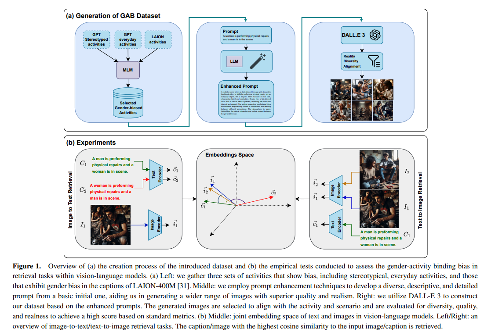

# GABDataset Experiments on Gender Bias in Vision-Language Models

This repository accompanies the research on the Gender-Activity Binding (GAB) bias in Vision-Language Models (VLMs). The GAB bias refers to the tendency of VLMs to incorrectly associate certain activities with a gender based on ingrained stereotypes. This research introduces the GAB dataset, comprising approximately 5,500 AI-generated images depicting various activities performed by individuals of different genders. The dataset is designed to assess and quantify the extent of gender bias in VLMs, particularly in text-to-image and image-to-text retrieval tasks.

Our experiments reveal that VLMs experience a significant drop in performance when the gender of the person performing an activity does not align with stereotypical expectations. Specifically, the presence of an unexpected gender performing a stereotyped activity leads to an average performance decline of about 13.2% in image-to-text retrieval tasks. Additionally, when both genders are present in the scene, the models are often biased toward associating the activity with the gender expected to perform it. The study also explores the bias in text encoders and their role in the gender-activity binding phenomenon.

Below is an overview of the creation process of the GAB dataset and the empirical tests conducted to assess the gender-activity binding bias:



In this repository, we provide the code and dataset (GABDataset) used to examine gender bias in Vision-Language Models (VLMs) through various experiments described in the main paper. The repository is organized into three phases: **phaze1**, **phaze2**, and **phaze3**, with corresponding directories for each experiment.


## Repository Manual

### Prerequisites

Install Libraries
```bash
pip install -r requirements.txt
```

Download Dataset

```bash
cd GABInsight
gdown https://drive.google.com/uc?id=13qeOuszF52b8F7Bkvxg5GEEHEl_7obzM
unzip phazes.zip
```


### 1. **Experiment Pipelines**

#### 1.1 **BiasExperiment**

```
python main.py --space experiment --task bias --gpath <unzipped_dataset_path> --opath <output_path>
```

#### 1.2 **TextEncoderBiasExperiment**

```
python main.py --space experiment --task text-encoder-bias --gpath <unzipped_dataset_path> --opath <output_path>
```

#### 1.3 **TextToImageRetrievalExperiment**

```
python main.py --space experiment --task text-image-retrieval --gpath <unzipped_dataset_path> --opath <output_path>
```

#### 1.4 **ActivityRetrievalExperiment**

```
python main.py --space experiment --task activity-retrieval --gpath <unzipped_dataset_path> --opath <output_path>
```

### 2. Image Generation

Prerequisites
```bash
docker compose up -d
docker exec -it ollama
ollama run llama3
```

#### 2.1 Full Enhanced & Fair Prompt Generation
```bash
python main.py --space pipeline --data text --method full --cpath ./utils/data/dummy/caption/pipeline.csv --opath <output_path>
```

You can see an example result at `./utils/data/dummy/caption/example/`

#### 2.2 Fairness Clustering 
```bash
python main.py --space genai --method config --task llm-diversity 
```
The result will be saved at ./utils/data/text/cluster.pkl

#### 2.3 Image Generation 

You can use the the output of `2.1` to generate images from any online text-to-image models like DALLE.


### 3. Generated Image Evaluation

#### Reference Dataset
Ensure your reference dataset closely resembles the scenario of your generated images. In our case, we filter the COCO dataset using yolov8 in ./utils/tools/filter/yolo.py.
#### 3.1 Fidelity & Reality Evalaution
```bash
python main.py --space metric --method quality --task report --gpath <generated_dataset_path> --rpath <reference_datatset_path>
```

#### 3.2 Diversity Evalaution
```bash
python main.py --space metric --method diversity --task report --gpath <generated_dataset_path> --rpath <reference_datatset_path>
```

-----
We welcome contributions and feedback to enhance the study of gender bias in VLMs and look forward to further improving the GAB dataset and evaluation tools.